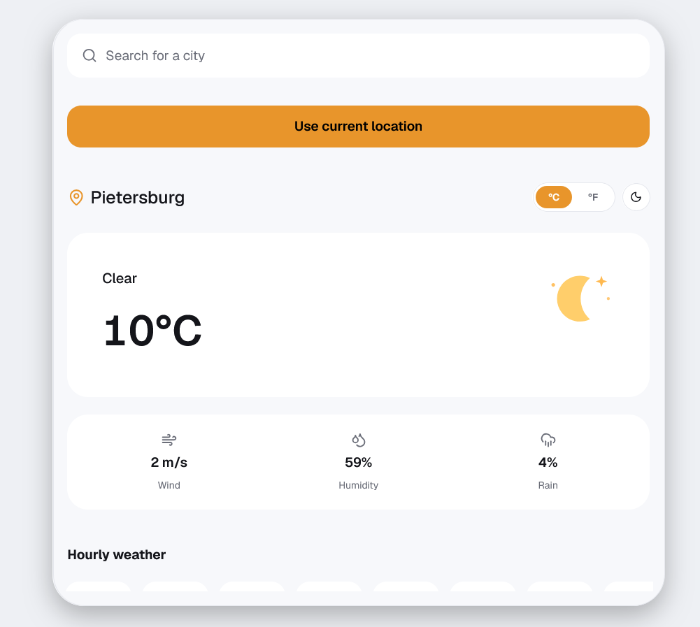

# Weather App 

A modern, responsive weather application built with **React 19**, **TypeScript**, and **Vite**. Get real-time weather data and multi-day forecasts for multiple locations with a beautiful, intuitive interface.

Live weather data is powered by the [WeatherAPI](https://www.weatherapi.com/) API, and all your data stays private—stored locally in your browser with zero backend tracking.

## Preview




## Features

- **Real-Time Weather Data** — Current conditions, wind speed, humidity, precipitation chance, and more
- **Multi-Day Forecasts** — 7-day forecast with hourly breakdowns for detailed planning
- **Location Management** — Save and switch between multiple locations instantly
- **Geolocation Support** — Auto-detect your current location with browser permissions
- **Smart Search** — Search-as-you-type city lookup with debouncing
- **Weather Alerts** — Intelligent client-side alerts for extreme conditions (high winds, storms, heavy rain, snow)
- **Push Notifications** — Optional browser notifications for weather alerts
- **Dark/Light Theme** — Customizable UI theme to match your preference
- **Temperature Units** — Toggle between Celsius and Fahrenheit
- **Fully Responsive** — Works seamlessly on mobile (320px+) and desktop
- **Privacy-First** — No backend server, no analytics, no data tracking—everything stays in your browser

## Getting Started

### Prerequisites

- **Node.js** (v16 or higher)
- **npm** or **yarn** package manager
- A free API key from [WeatherAPI](https://www.weatherapi.com/)

### Installation

1. **Get a free API key**
   - Visit [weatherapi.com](https://www.weatherapi.com/)
   - Sign up for a free account
   - Copy your API key from your account dashboard

2. **Clone and setup the project**
   ```bash
   git clone <repository-url>
   cd weather-app
   npm install
   ```

3. **Configure environment variables**
   ```bash
   cp .env.example .env
   ```
   Edit `.env` and add your API key:
   ```
   VITE_WEATHERAPI_KEY=your_api_key_here
   ```

4. **Start the development server**
   ```bash
   npm run dev
   ```
   The app will open at `http://localhost:5173` (or next available port)

### Available Scripts

```bash
npm run dev       # Start development server
npm run build     # Type-check and build for production
npm run preview   # Preview the production build locally
npm run lint      # Run ESLint to check code quality
```

## API Configuration

### Getting Your WeatherAPI Key

1. Go to [weatherapi.com](https://www.weatherapi.com/)
2. Click "Sign Up" and create a free account
3. Navigate to your dashboard and find the "API Key" section
4. Copy your key and paste it into your `.env` file

**Note:** The free tier is sufficient for personal use and includes:
- Current weather data
- 7-day forecast
- Location search
- Unlimited API calls

For production use or higher limits, consider upgrading to a paid plan.

## Tech Stack

| Technology | Purpose |
|------------|---------|
| **React 19** | Component-based UI framework with hooks |
| **TypeScript** | Full type safety and better developer experience |
| **Vite** | Lightning-fast dev server and optimized production builds |
| **lucide-react** | Beautiful, consistent icon library |
| **WeatherAPI** | Real-time weather data and forecasting |
| **localStorage** | Client-side data persistence (locations, settings, cache) |
| **ESLint** | Code quality and style consistency |

## WeatherAPI Endpoints Used

The app leverages two key WeatherAPI endpoints to fetch all weather data:

| Endpoint | Purpose | Use Case |
|----------|---------|----------|
| `GET /forecast.json` | Retrieves current conditions + 7-day forecast | Fetching detailed weather for a location |
| `GET /search.json` | Location search and reverse lat/lon lookup | Finding locations by name or coordinates |

## How It Works

### Current Location
When you click "Use Current Location," the app:
1. Requests browser geolocation permission
2. Gets your lat/lon coordinates
3. Reverse-geocodes to find your city name
4. Fetches weather data and saves the location

### Search & Save Locations
- Type any city name in the search bar
- Results appear in real-time (debounced to reduce API calls)
- Click a result to view its forecast
- Location is automatically saved for future reference
- Access all saved locations from the Locations page

### Weather Alerts
Alerts are generated on the client-side by analyzing live conditions:
- **High Wind** — Wind gusts exceed 40 km/h
- **Thunderstorms** — Lightning detected in forecast
- **Heavy Rain** — Precipitation chance exceeds 80%
- **Snow/Freezing** — Snow expected or temperature near/below freezing

## Project Structure

```
src/
├── api/              WeatherAPI fetch helpers and location lookup
├── components/       Reusable UI components
│   ├── AlertBanner        In-app alert notifications
│   ├── WeatherHero        Large weather display card
│   ├── HourlyForecast     Hourly weather breakdown
│   ├── DailyForecast      Multi-day forecast grid
│   ├── SearchBar          Location search with autocomplete
│   ├── LocationCard       Saved location preview
│   ├── SkeletonLoader     Loading placeholders
│   ├── StatsRow           Weather stats display
│   ├── WeatherIcon        Dynamic weather icon renderer
│   ├── TopBar             Navigation header
│   ├── AppShell           Main layout container
│   └── EmptyLocationState  Empty state UI
├── context/          App-wide state management
│   ├── AppContext         Locations, theme, units, cache
│   └── ToastContext       In-app notifications
├── hooks/            Custom React hooks
│   └── useLocalStorage    Persistent state hook
├── pages/            Page components
│   └── Home              Main weather view
├── types/            TypeScript type definitions
│   └── weather.ts        Weather data types
├── utils/            Utility functions
│   ├── alerts.ts         Alert derivation logic
│   └── weatherCode.ts    Weather condition mapping
├── App.tsx           Root component
├── main.tsx          App entry point
└── index.css         Global styles
```

### Architecture Highlights

**State Management**
- Uses React Context API via `AppContext` for app-wide state (locations, theme, units, weather cache)
- `useApp()` hook provides access to context without prop drilling
- `ToastContext` manages in-app notifications separately

**Component Design**
- All components are reusable and prop-driven
- Example: `WeatherIcon` renders the correct icon based on weather condition code
- `LocationCard`, `StatsRow`, and other components are highly composable

**Data Persistence**
- `useLocalStorage` hook syncs app state with browser storage
- Saves: locations, active location, theme preference, units (C/F), API responses
- No backend required—everything is client-side

## Responsiveness & Browser Support

### Responsive Design
The app is built mobile-first and scales fluidly across all device sizes:
- **Mobile** (320px+) — Optimized touch interface
- **Tablet** (480-768px) — Tablet-friendly layout
- **Desktop** (1024px+) — Full-featured desktop experience

The centered card layout maintains visual hierarchy and usability at all breakpoints.

### Browser Compatibility
- **Modern browsers only** — Requires ES2020+ support
- **Chrome/Brave** 90+
- **Firefox** 88+
- **Safari** 14+
- **Edge** 90+

**Required APIs:**
- `localStorage` — For data persistence
- `Geolocation API` — For "Use Current Location"
- `Notification API` — For push notifications (optional)

## Troubleshooting

### Common Issues

**"API Key not found" error**
- Ensure you've created `.env` file in the root directory
- Check that `VITE_WEATHERAPI_KEY` is spelled correctly
- Restart the dev server after changing `.env`

**No location data appears**
- Verify your API key is valid at weatherapi.com
- Check browser console for network errors
- Ensure API quota hasn't been exceeded

**Geolocation not working**
- Allow location access when prompted by browser
- Only works over HTTPS in production (HTTP for localhost dev)
- Check browser privacy settings

**Data not persisting**
- Check if localStorage is enabled in browser
- Ensure you're not in private/incognito mode
- Clear browser cache if experiencing issues

**Build fails**
- Run `npm install` to ensure all dependencies are installed
- Delete `node_modules` and `package-lock.json`, then reinstall
- Check Node.js version: `node --version` (should be 16+)

## Privacy & Security

✅ **Zero data collection** — No analytics, no tracking, no third-party scripts
✅ **Local-only storage** — Everything saved in browser localStorage
✅ **No backend server** — Reduced attack surface
✅ **API key protection** — Stored in `.env`, never committed to git
✅ **Transparent practices** — Privacy statement visible in Settings

## Development

### Code Quality
- **TypeScript** — Strict type checking for fewer runtime errors
- **ESLint** — Consistent code style and best practices
- **React 19** — Latest features and performance improvements
- **Vite** — Fast HMR (hot module replacement) for quick development

### Building for Production
```bash
npm run build
npm run preview  # Test production build locally
```

The build outputs to `dist/` with optimized bundles ready for deployment.

### Deployment
This is a static site—deploy to any static host:
- **Vercel** — `vercel deploy`
- **Netlify** — Connect GitHub repo
- **GitHub Pages** — Push to gh-pages branch
- **Any CDN** — Upload contents of `dist/` folder

Remember to set your API key as an environment variable in your hosting platform!

## Future Enhancements

Potential features for future versions:
- 14-day forecast
- Radar maps and weather animations
- Historical weather data
- Weather trends and analytics
- Multi-language support
- Custom alert thresholds
- Weather comparison between locations

## Author

**Khaviso Vukeya**
- [LinkedIn](https://www.linkedin.com/in/khaviso-vukeya-81b0a9320)
- [Portfolio](https://khaviso-vukeya-portfolio.vercel.app/)
